### autocompelete_fields
[admin.BaseModelAdmin.autocompelete_fields](admin-tutorial/AdminDateHierarchy/simple_relate/admin.py#L27)
将`select`替换成`select2`, 支持搜索功能, 作用于`ForeignKey`字段.   
`autocompelete_fields` 属性依赖 [`search_fields`](admin-tutorial/AdminDateHierarchy/simple_relate/admin.py#L7) 字段一起使用.

  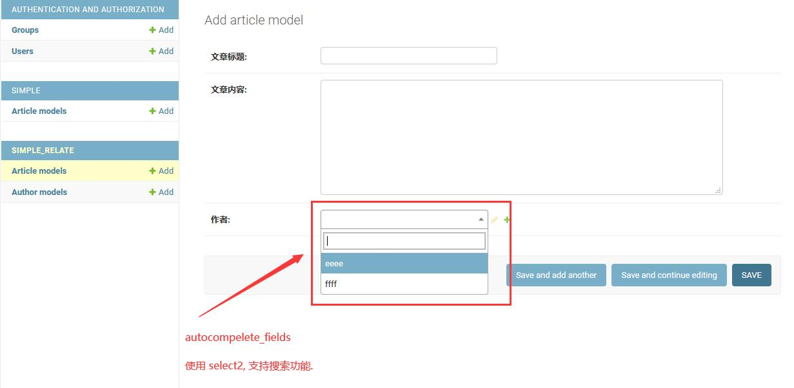

&nbsp;  
&nbsp;  
### raw_id_fields
[admin.BaseModelAdmin.raw_id_fields](admin-tutorial/AdminFilter/filter_horizontal_/admin.py#L16)
将`drop-down`或`select-box`字段的风格, 替换成`input`.  
当该字段是`ForeignKey`时, 只显示该`id`; 
当该字段时`ManyToMany`时, 用逗号分隔并显示多个`id`; 

  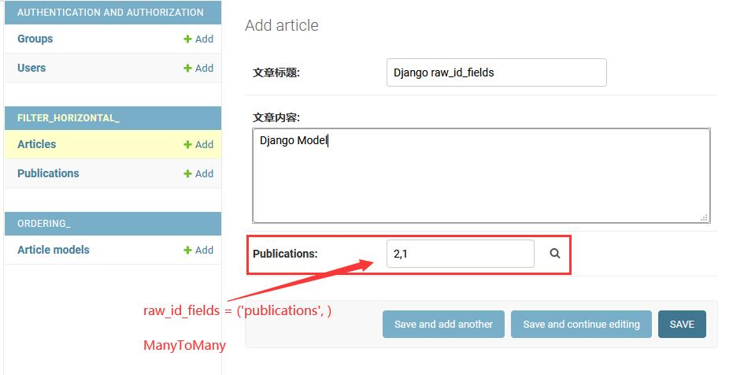

&nbsp;  
&nbsp;  
### fields
[admin.BaseModelAdmin.fields](admin-tutorial/AdminFields/fields_/admin.py#L8)
该字段用于控制编辑页面的表单字段排版, 可以一行一个字段, 可以一行多个字段, 也可以定义字段的显示顺序.   

  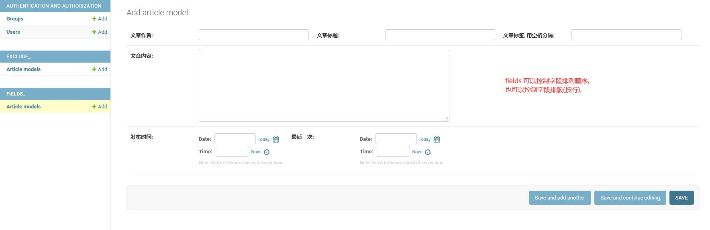

&nbsp;      
&nbsp;  
### exclude  
[admin.BaseModelAdmin.exclude](admin-tutorial/AdminFields/exclude_/admin.py#L18)
定义在 `exclude` 集合中的字段, 将不会显示在表单中.

  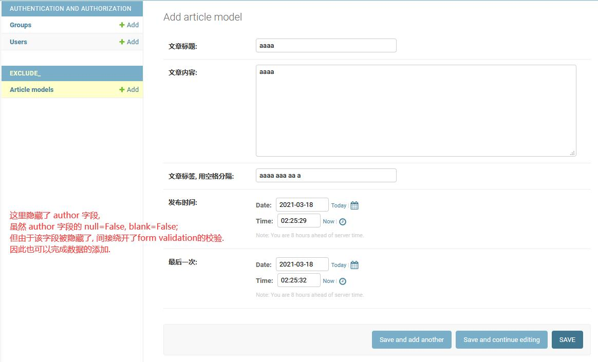

    

&nbsp;  
&nbsp;  
### fieldsets
[admin.BaseModelAdmin.fieldsets](admin-tutorial/AdminFields/fieldsets_/admin.py#L8)   
`fieldsets` 不同于 `fields`, 它是一个栏目集合, 每个元素表示一个栏目.   
`fieldsets` 它是一个特定格式的数据, 它要求集合中每个元素都必须是一个`list`或`tuple`.    
`fieldsets` 要求集合中每个元素都必须是2个子元素.   
`fieldsets` 第一个子元素, 用于描述栏目名称; `None`表示隐藏栏目, `str`表示显示栏目信息.    
`fieldsets` 第二个子元素, 用于描述栏目内中的内容;    
`fieldsets` 第二个子元素, 必须是一个字典数据类型, 它定义了三个可描述字段: `fields`, `classes`, `description`.   
- fields   
  该字段的值与上面的`admin.ModelAdmin.fields`一致.
- classes   
  该字段的值类型是一个`list`或`tuple`, 每个元素都是一个`css`样式值, 
  用于扩展栏目样式, 常见的样式值有: `collapse`, `wide`, `extrapretty`.
- description   
  该字段的值类型是字符串, 用于在栏目下方显示栏目描述信息.  
  

  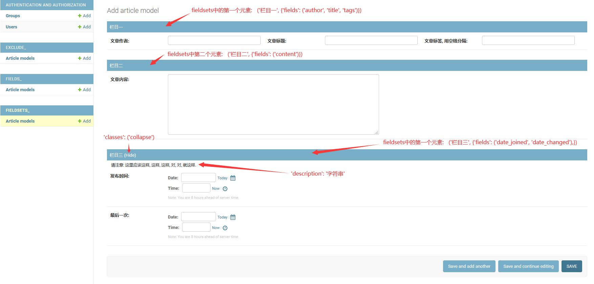

> 备注:   
> 如果没有设定 `fields` 也没有设定 `fieldsets`,    
> 那么 `Django` 会显示所有字段(排除掉那些AutoField字段,   
> 比如说: primary_key, date[auto_now=True], datetime[auto_now=True]).
>        
> 另外, `fields` 和 `fieldsets` 同一时间只能设定一个, 否则将会报错.    

&nbsp;  
&nbsp;  
### filter_vertical
[admin.BaseModelAdmin.filter_vertical](admin-tutorial/AdminFilter/filter_horizontal_/admin.py#L8) 
该属性用于纵向修饰多对多字段的表单控件.  

  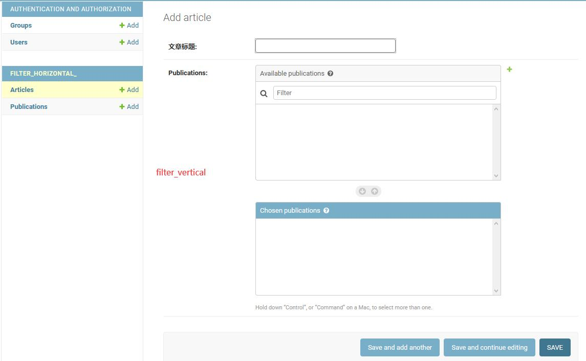

&nbsp;  
&nbsp;  
### filter_horizontal
[admin.BaseModelAdmin.filter_horizontal](admin-tutorial/AdminFilter/filter_horizontal_/admin.py#L7) 
该属性用于纵向修饰多对多字段的表单控件.  

  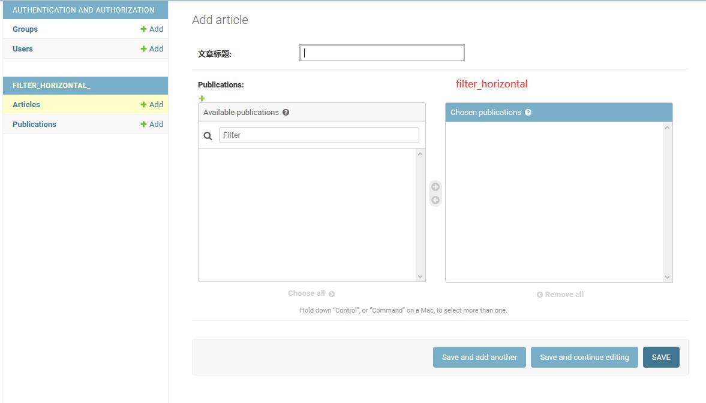

&nbsp;  
&nbsp;  
### radio_fields
[admin.BaseModelAdmin.radio_fields](admin-tutorial/AdminDateHierarchy/simple_relate/admin.py#L25)
将`drop-down`替换成`radio`, 支持`Choices`和`ForeignKey`字段.   

  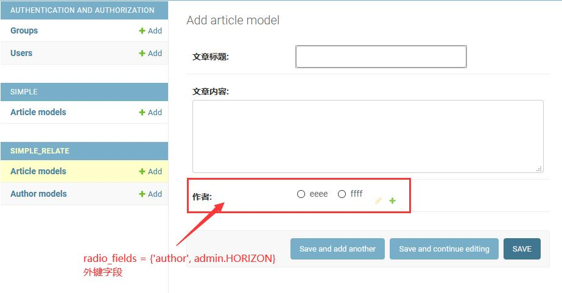

&nbsp;  
&nbsp;  
### prepopulated_fields
[admin.BaseModelAdmin.prepopulated_fields](admin-tutorial/AdminDateHierarchy/simple_relate/admin.py#L41) 
该字段用于配合 `slugField` 字段来预填充值;    
在`add`和`change`表单中, `javascript`会监控指定字段的`change`事件, 实时把更新填写到`slugField`字段中.  

  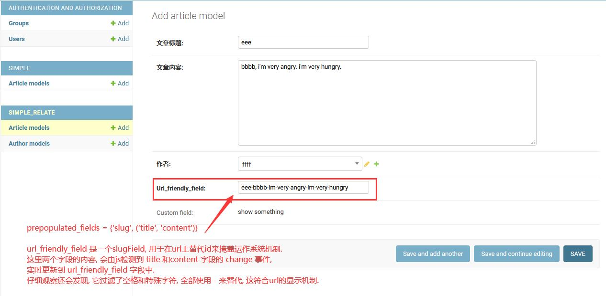

&nbsp;  
&nbsp;  
### formfield_overrides
[admin.BaseModelAdmin.formfield_overrides](admin-tutorial/AdminDateHierarchy/simple_relate/admin.py#L51)
该属性用于替换表单字段的控件;

  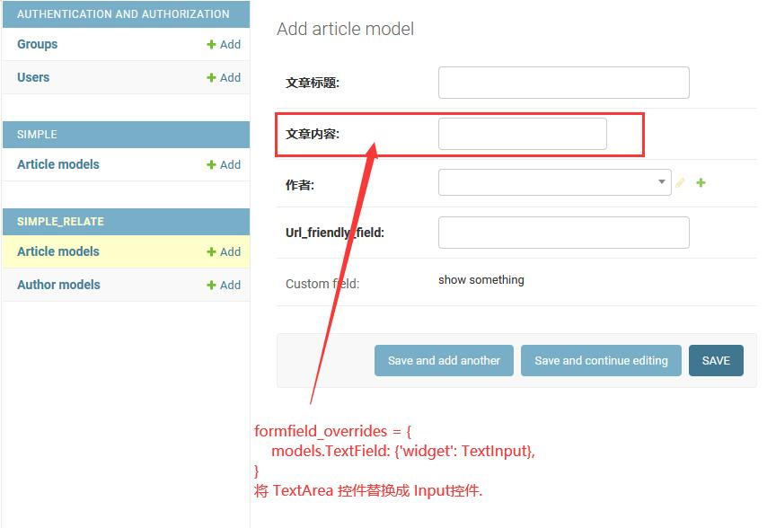

&nbsp;  
&nbsp;  
### readonly_fields
[admin.BaseModelAdmin.readonly_fields](admin-tutorial/AdminDateHierarchy/simple_relate/admin.py#L29)
将指定字段设定为只读, 在新增、编辑页面中都不可编辑(观点: 这不符合已有字段的使用场景).  
该属性支持读取方法的运行结果作为字段值, 这就让它变得非常有意义了, 这使得它甚至跟`view_on_site`一样有意义.   
通过在方法内自定义显示的html内容, 可以补充外链去展示自己想展示的信息.
- `change`列表页面  
    

      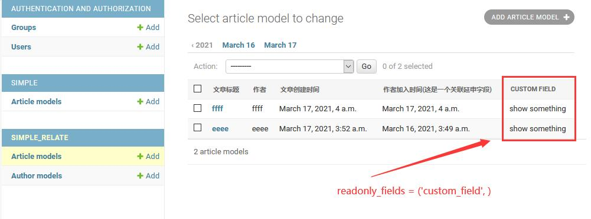
    

- `add`新增页面
    

      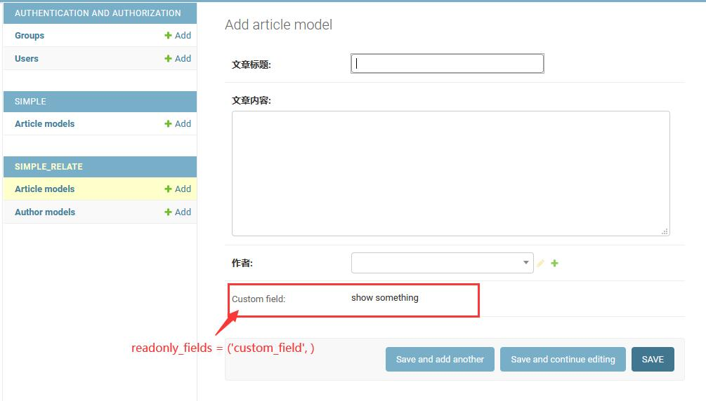
    

> 备注:   
> list_display 支持指定函数, 即: 将该函数的运行结果当作字段值来显示; TODO: 如果返回html是否正常渲染, 待确认.   
> readonly_fields 也支持指定函数, 作用和 list_display 稍微重叠; 但是可以确认的是它支持html渲染.   

&nbsp;  
&nbsp;  
### ordering
[admin.BaseModelAdmin.ordering](admin-tutorial/AdminFilter/ordering_/admin.py#L10) 
在 `change` 列表页面, 按给定的字段排序显示数据.  

  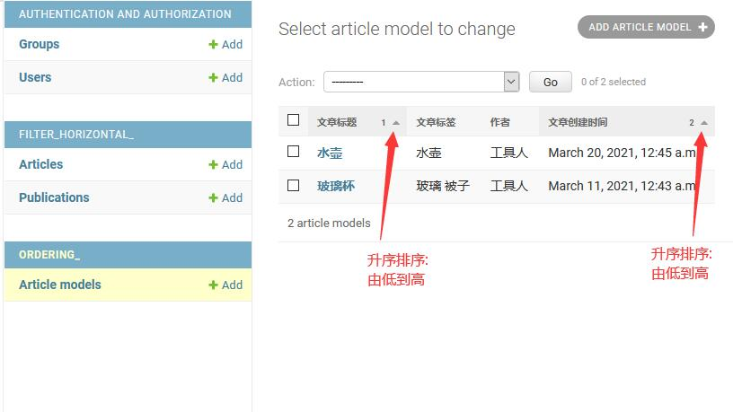

&nbsp;  
&nbsp;  
### sortable_by
[admin.BaseModelAdmin.sortable_by](admin-tutorial/AdminFilter/ordering_/admin.py#L11) 
在 `change` 列表页面, 限定可排序字段.   
默认情况下, `Django` 允许所有字段拥有排序功能(即: 点击字段头可以进行该字段的升序或降序功能).  
通过定义 `sortable_by` 字段, 告诉 `Django` 只有这个范围的字段可以排序, 其他字段关闭排序功能.

  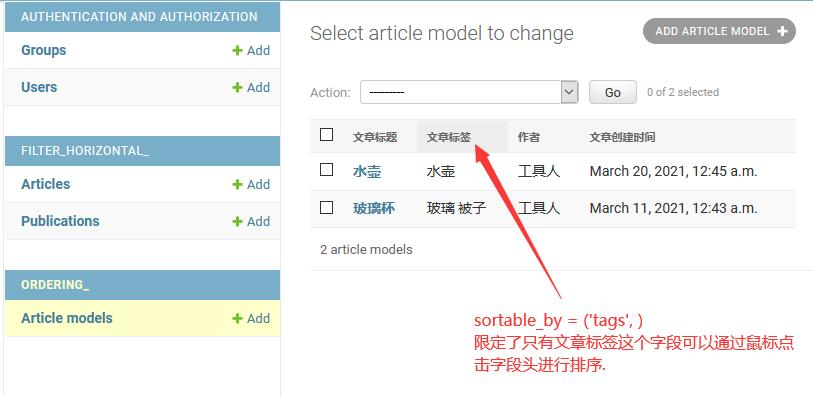

&nbsp;  
&nbsp;  
### view_on_site
[admin.BaseModelAdmin.view_on_site](admin-tutorial/AdminFilter/ordering_/admin.py#L20) 
`Django`提供了一个`change_form`模板, 
用于在修改数据页面的表单上方显示一个自定义链接("VIEW ON SITE"), 
通过这个链接可以跳转到任何网站(但通常是与该条数据相关的网址, 良心功能).    

1. `view_on_site` 是 `True` 时, 
   需定义 `admin.ModelAdmin.get_absolute_url` 方法, 
   此时 `Django` 会使用 `django.urls.reverse('admin:view_on_site')` 生成对应的 `admin` 站内链接.  
2. `view_on_site` 是 `False` 时, 不显示 "VIEW ON SITE" 链接.   
3. `view_on_site` 是方法时, 在修改数据页面的表单上方显示 "VIEW ON SITE" 链接.  
   

     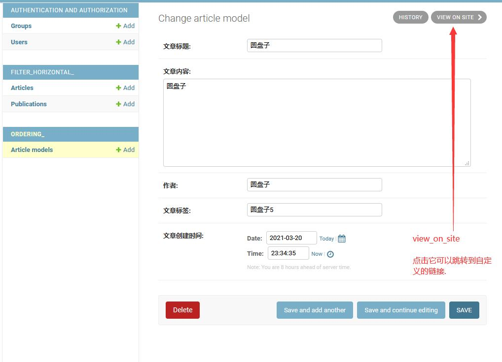
   

4. `view_on_site` 是方法时, 可以在 `list_display` 中加入 `view_on_site` 字段, 
   在`change`列表页面显示链接, 可快速的跳转到对应的数据页面(良心功能).
   

     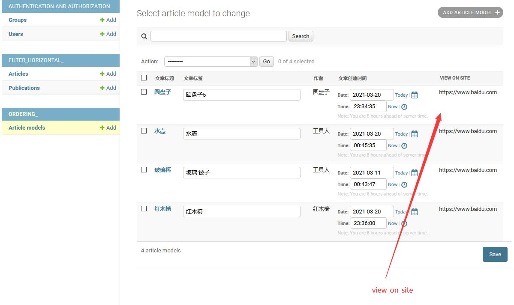
   

&nbsp;  
&nbsp;  
### show_full_result_count
[admin.BaseModelAdmin.show_full_result_count](admin-tutorial/AdminFilter/ordering_/admin.py#L14) 
该属性配合`search_fields`, 共同显示搜索命中几条数据和总共几条数据信息.   

  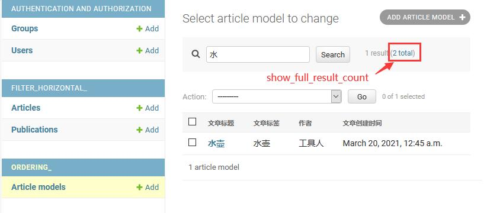

