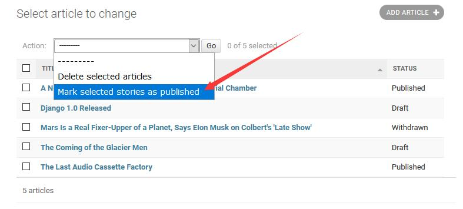
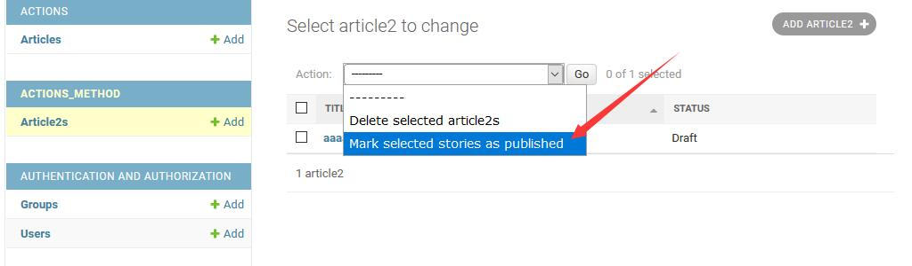
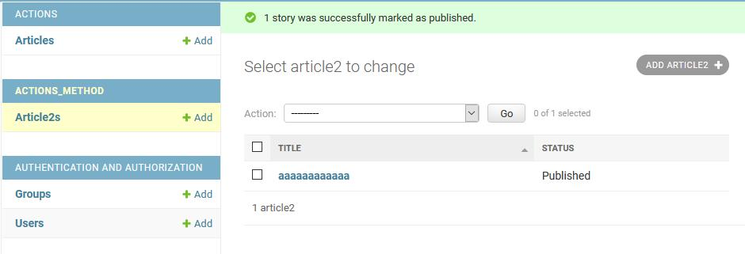
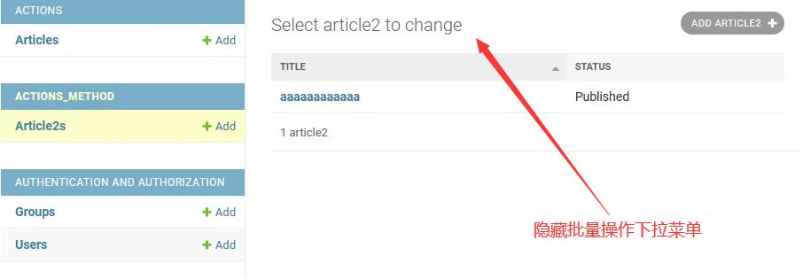
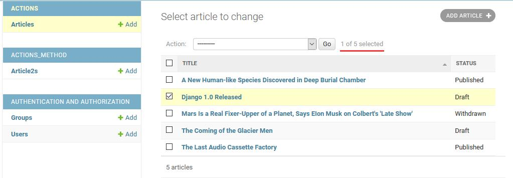
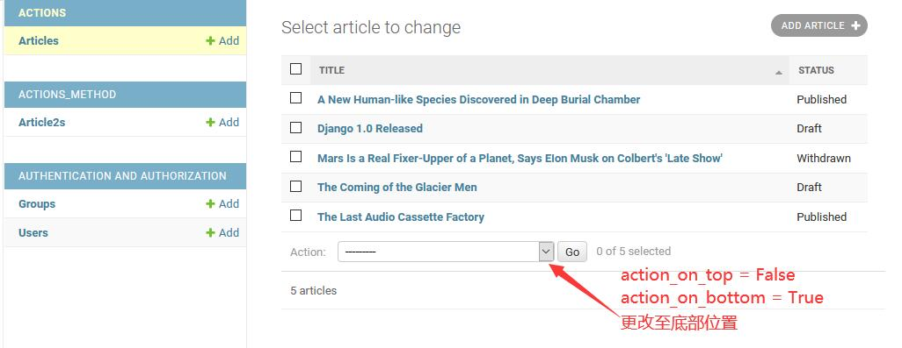

django 默认情况下提供了批量删除功能, 
除此之外它也提供了
[批量操作](https://docs.djangoproject.com/en/3.1/ref/contrib/admin/actions/#admin-actions)
支持(仅需要稍做配置和少量代码编写). 
下面将围绕 `django.contrib.admin.ModelAdmin.actions` 进行操作.

&nbsp;  

### 批量更新字段状态(函数)
[actions app](actions/__init__.py) 通过在 [admin.py](actions/admin.py#L16) 中声明 `actions = [make_published]`, 
`django admin` 会在 `change list` 页面的批量操作下拉菜单中加入该操作指令.

  

&nbsp;  

### 批量更新字段状态(方法)
[admin.py](actions_method/admin.py#L12) 中 `actions = ['make_published', ]` 列表内用字符串表示按`admin.ModelAdmin`的`self.make_published`方法来操作.

  

&nbsp;  

### 批量更新字段状态(返回用户消息)
[admin.py](actions_method/admin.py#L35) 中 `self.message_user` 方法用于发送提示消息给用户.

  

&nbsp;  

### 隐藏批量操作的下拉菜单
- 控制单个Model    
  [admin.py](actions_method/admin.py#L12) 中的 `actions = None` 用于表示关闭整个批量操作的下拉菜单
- 全局隐藏  
  也可以通过[全局隐藏](https://docs.djangoproject.com/en/3.1/ref/contrib/admin/actions/#disabling-a-site-wide-action), 
  哪个Model需要就在该Model中声明 'delete_selected'.
- 根据条件来决定是隐藏还是开放   
  重新定义(覆盖) [get_actions](actions_method/admin.py#L38) 接口, 根据具体条件来返回具体的`actions`值.  

  

 
 &nbsp;  

### 隐藏批量操作右侧的已选中计数器
[admin.py](actions_method/admin.py#L16) 中的 `actions_selection_counter = False` 用于表示关闭批量操作右侧的计数器.

  

&nbsp;  

### 批量操作下拉菜单位置控制(上或下)
[admin.py](actions_method/admin.py#L18) 中的 `actions_on_top = False; actions_on_bottom = True` 用于表示将批量操作栏移至底部.

  

