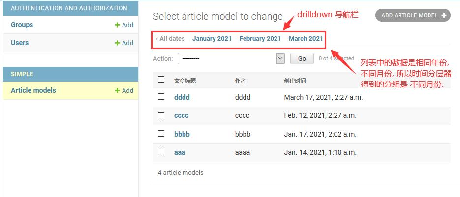
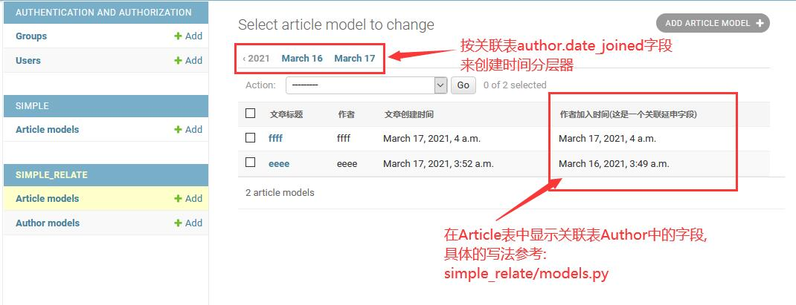

`Django` 提供了一个按[时间分层器](https://docs.djangoproject.com/en/3.1/ref/contrib/admin/#django.contrib.admin.ModelAdmin.date_hierarchy)来筛选数据功能, 从页面中能看到的是一个 `drilldown` 导航栏;  
 当 `change list` 表格的数据的创建时间分布于当月不同时间, 那么时间分层器会显示当月具体日期时间(按所有数据-日-分组所得).     
 当 `change list` 表格的数据的创建时间分布于当年不同时间, 那么时间分层器会显示当年具体月份时间(按所有数据-月-分组所得).    
 当 `change list` 表格的数据的创建时间分布于不同年份, 那么时间分层器会显示不同年份时间(按所有数据-年-分组所得).    
 
`admin.ModelAdmin.date_hierarchy` 支持两种写法:
- [普通字段](simple/admin.py#L18)
  

    
  

- [关联字段](simple_relate/admin.py#L21)
  

    
  

 
