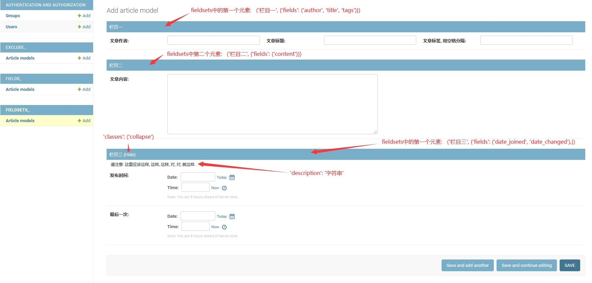

[admin.ModelAdmin.exclude](exclude_/admin.py#L18) 属性作用于 `add` 和 `change` 表单页面中(服务于表单字段), 
表示: 定义在 `exclude` 集合中的字段, 将不会显示在表单中.
  

    
  

&nbsp;  

[admin.ModelAdmin.fields](fields_/admin.py#L8) 属性作用于 `add` 和 `change` 表单页面(控制于表单字段排版);   
表单中仅显示那些定义在 `fields` 集合中的字段, `fields`除了控制字段的显示之外, 还可以控制字段的排版(顺序, 分行).
  

    
  

&nbsp;  
  
[admin.ModelAdmin.fieldsets](fieldsets_/admin.py#L8) 属性作用于 `add` 和 `change` 表单页面(控制于表单字段排版);  
`fieldsets` 不同于 `fields`, 它是一个栏目集合, 每个元素表示一个栏目.   
`fieldsets` 它是一个特定格式的数据, 它要求集合中每个元素都必须是一个`list`或`tuple`.    
`fieldsets` 要求集合中每个元素都必须是2个子元素.   
`fieldsets` 第一个子元素, 用于描述栏目名称; `None`表示隐藏栏目, `str`表示显示栏目信息.    
`fieldsets` 第二个子元素, 用于描述栏目内中的内容;    
`fieldsets` 第二个子元素, 必须是一个字典数据类型, 它定义了三个可描述字段: `fields`, `classes`, `description`.   
- fields   
  该字段的值与上面的`admin.ModelAdmin.fields`一致.
- classes   
  该字段的值类型是一个`list`或`tuple`, 每个元素都是一个`css`样式值, 
  用于扩展栏目样式, 常见的样式值有: `collapse`, `wide`, `extrapretty`.
- description   
  该字段的值类型是字符串, 用于在栏目下方显示栏目描述信息.  
  
  

    
  

&nbsp;  
                  
> 备注:   
> 如果没有设定 `fields` 也没有设定 `fieldsets`,    
> 那么 `Django` 会显示所有字段(排除掉那些AutoField字段,   
> 比如说: primary_key, date[auto_now=True], datetime[auto_now=True]).
>        
> 另外, `fields` 和 `fieldsets` 同一时间只能设定一个, 否则将会报错.    