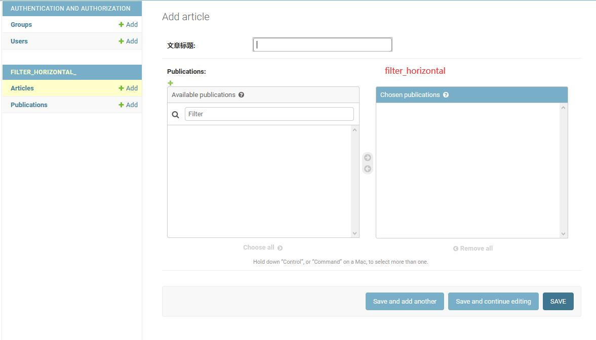
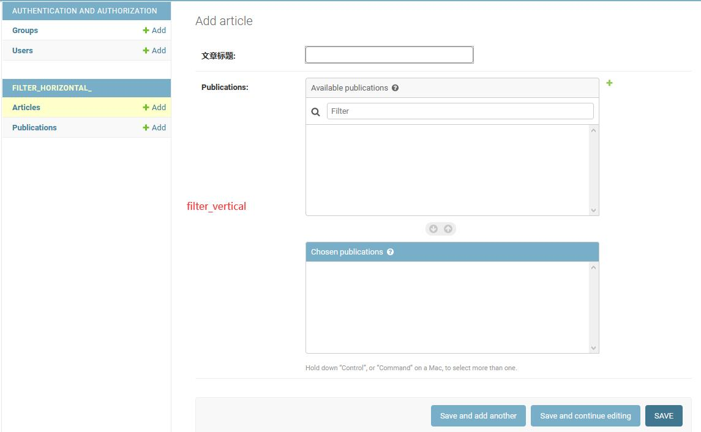
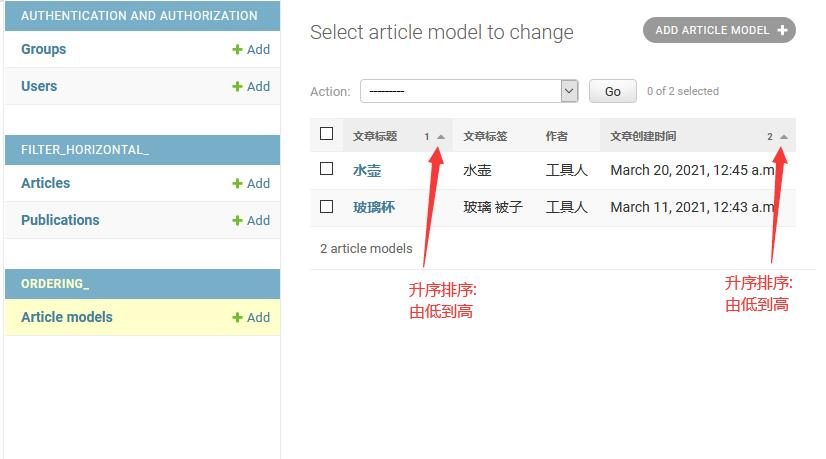
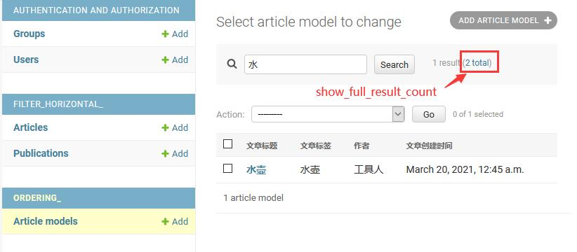
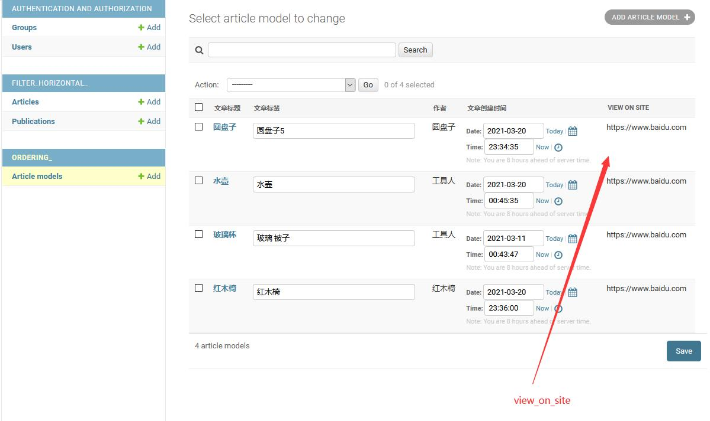
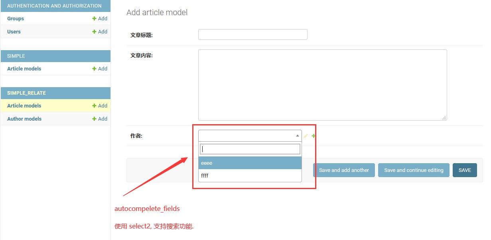
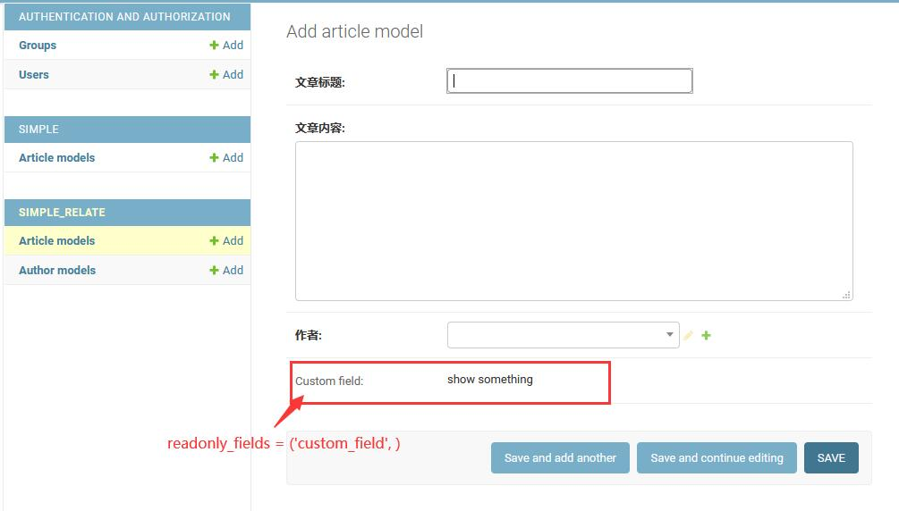

默认情况下, `Django Admin`针对 `ManyToMany`字段 采用的是 `select multiple`(html tag 标签) 来显示, 
除此之外 `Django Admin` 还提供了下面两个属性来修饰 `ManyToMany` 字段, 让它支持搜索功能 和 多次操作功能. 
 
&nbsp;  

[admin.ModelAdmin.filter_horizontal](filter_horizontal_/admin.py#L7) 横向选择多个关联对象.

  

&nbsp;  
   
[admin.ModelAdmin.filter_vertical](filter_horizontal_/admin.py#L8) 纵向选择多个关联对象.   

  

&nbsp;  
### list_display_links
[admin.ModelAdmin.list_display_links](filter_horizontal_/admin.py#L11) 将链接显示在指定字段, 默认是显示在第一个字段.   

  

&nbsp;   
### list_per_page
[admin.ModelAdmin.list_per_page](filter_horizontal_/admin.py#L13) `change`列表页面, 每页显示多少条数据.     
[admin.ModelAdmin.list_max_show_all](filter_horizontal_/admin.py#L14) 列表页面下方的分页最右侧的`Show all`, 显示多少条数据.      

  

&nbsp;   
### list_select_related
当访问 `chang` 列表页面时, `Django`默认不会去提取关联表信息(select_related);     
只有一种情况会主动去查询关联表信息, 即: 当`list_display` 集合中包含了外键字段时, 才会主动去查询关联表信息(select_related).   
另外一种情况那就是当 `list_select_related` 属性是 `True` 时, `Django`也会主动去查询关联表信息(select_related).   

`select_related`方法回归到原始`sql`是采用了 `inner join` 把两张表的字段都提取出来;

&nbsp;  
### ordering
[admin.ModelAdmin.ordering](ordering_/admin.py#L9) 在 `change` 列表页面, 按给定的字段排序显示数据.  

  

&nbsp;  
### sortable_by
[admin.ModelAdmin.sortable_by](ordering_/admin.py#L10) 在 `change` 列表页面, 限定可排序字段.   
默认情况下, `Django` 允许所有字段拥有排序功能(即: 点击字段头可以进行该字段的升序或降序功能).  
通过定义 `sortable_by` 字段, 告诉 `Django` 只有这个范围的字段可以排序, 其他字段关闭排序功能.

  

&nbsp;  
### show_full_result_count
[admin.ModelAdmin.show_full_result_count](ordering_/admin.py#L13) 该属性配合`search_fields`, 共同显示搜索命中几条数据和总共几条数据信息.   

  

&nbsp;  
### preserve_filters
[admin.ModelAdmin.preserve_filters](ordering_/admin.py#L15)  
在已过滤(搜索)的列表中修改、删除、创建数据完成后再次返回到列表页面时, 是否保留搜索状态.  
`preserve_filters` 是 `bool`类型变量, `True`时表示保留搜索状态, `False`时表示不保留搜索状态;  

  

&nbsp;  
### list_editable
[admin.ModelAdmin.list_editable](ordering_/admin.py#L17) 
`Django`允许在`change`列表页面一次性编辑多条数据.   
`list_editable` 是 `list` / `tuple` 类型变量, 填写字段名, 表示字段可以在`chang`列表页面编辑多条数据.  

  

&nbsp;  
### view_on_site
[admin.ModelAdmin.view_on_site](ordering_/admin.py#L20) 
`Django`提供了一个`change_form`模板, 
用于在修改数据页面的表单上方显示一个自定义链接("VIEW ON SITE"), 
通过这个链接可以跳转到任何网站(但通常是与该条数据相关的网址, 良心功能).    

1. `view_on_site` 是 `True` 时, 
   需定义 `admin.ModelAdmin.get_absolute_url` 方法, 
   此时 `Django` 会使用 `django.urls.reverse('admin:view_on_site')` 生成对应的 `admin` 站内链接.  
2. `view_on_site` 是 `False` 时, 不显示 "VIEW ON SITE" 链接.   
3. `view_on_site` 是方法时, 在修改数据页面的表单上方显示 "VIEW ON SITE" 链接.  
   

     
   

4. `view_on_site` 是方法时, 可以在 `list_display` 中加入 `view_on_site` 字段, 
   在`change`列表页面显示链接, 可快速的跳转到对应的数据页面(良心功能).
   

     
   

&nbsp;  
### raw_id_fields
[admin.ModelAdmin.raw_id_fields](ordering_/admin.py#L16)
将`drop-down`或`select-box`字段的风格, 替换成`input`.  
当该字段是`ForeignKey`时, 只显示该`id`; 
当该字段时`ManyToMany`时, 用逗号分隔并显示多个`id`; 

  

&nbsp;  
### radio_fields
[admin.ModelAdmin.radio_fields](../AdminDateHierarchy/simple_relate/admin.py#L25)
将`drop-down`替换成`radio`, 支持`Choices`和`ForeignKey`字段.   

  

&nbsp;  
### autocompelete_fields
[admin.ModelAdmin.autocompelete_fields](../AdminDateHierarchy/simple_relate/admin.py#L27)
将`select`替换成`select2`, 支持搜索功能, 作用于`ForeignKey`字段.   
`autocompelete_fields` 属性依赖 [`search_fields`](../AdminDateHierarchy/simple_relate/admin.py#L7) 字段一起使用.

  

&nbsp;  
### readonly_fields
[admin.ModelAdmin.readonly_fields](../AdminDateHierarchy/simple_relate/admin.py#L29)
将指定字段设定为只读, 在新增、编辑页面中都不可编辑(观点: 这不符合已有字段的使用场景).  
该属性支持读取方法的运行结果作为字段值, 这就让它变得非常有意义了, 这使得它甚至跟`view_on_site`一样有意义.   
通过在方法内自定义显示的html内容, 可以补充外链去展示自己想展示的信息.
- `change`列表页面  
    

      
    

- `add`新增页面
    

      
    

&nbsp;  
### prepopulated_fields
[admin.ModelAdmin.prepopulated_fields](../AdminDateHierarchy/simple_relate/admin.py#L41) 
该字段用于配合 `slugField` 字段来预填充值;    
在`add`和`change`表单中, `javascript`会监控指定字段的`change`事件, 实时把更新填写到`slugField`字段中.  

  

&nbsp;  
### formfield_overrides
[admin.ModelAdmin.formfield_overrides](../AdminDateHierarchy/simple_relate/admin.py#L51)
该属性用于替换表单控件;

  

&nbsp;  
### save_as
[admin.ModelAdmin.save_as](../AdminDateHierarchy/simple_relate/admin.py#L60)
该属性作用在 change 编辑页面.      
`False` 时, 表单底部显示 'Save and add another' 按钮.    
`True` 时, 表单底部显示 'save as new' 按钮.     
'save as new' 的作用是, 当模块表单字段过多, 新建一条数据时间成本较高时,    
可以采取编辑一条数据, 按需更改几个必要字段后, 点击 'save as new' 完成一条数据的创建.   

  

&nbsp;  
### save_as_continue
[admin.ModelAdmin.save_as_continue](../AdminDateHierarchy/simple_relate/admin.py#L60)
该属性作用在 `save_as=True` 基础上, 告诉`Django`数据创建完成后, 是进入编辑界面还是返回`change`列表页面.  
`save_as_continue=True` 时, 数据创建完成后， 重定向到编辑页面.
`save_as_continue=False` 时, 数据创建完成后, 重定向到`change`列表页面.

&nbsp; 
### save_on_top 
[admin.ModelAdmin.save_on_top](../AdminDateHierarchy/simple_relate/admin.py#L63) 开启这个属性, 会出现两行按钮保存栏, 他们分别出现在表单的头部和表单的底部.

  

 