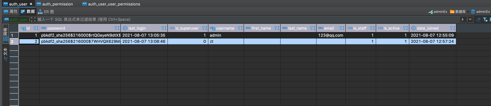
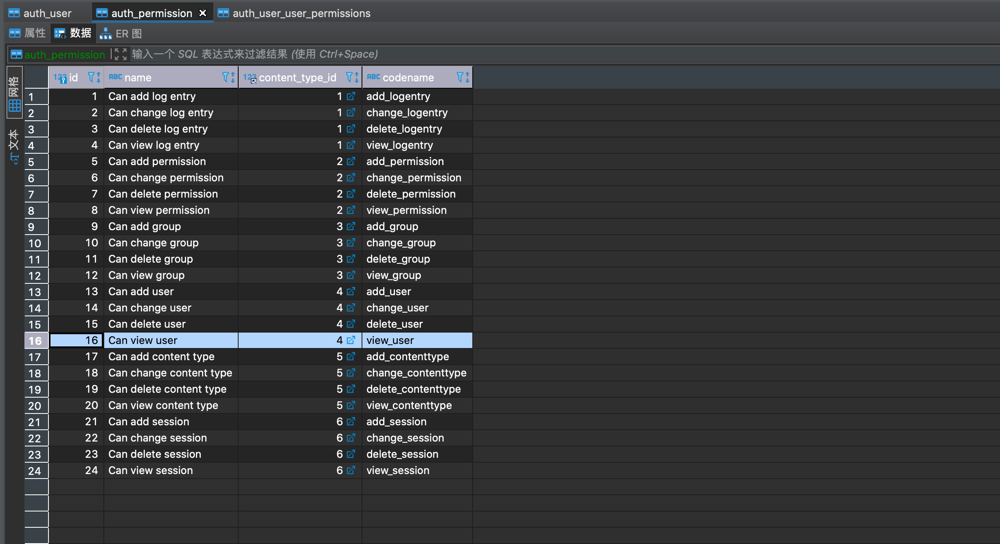
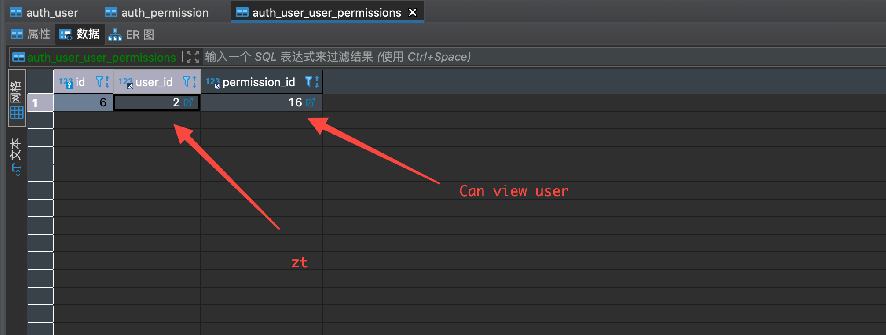

当我给一个用户添加 `CanViewUser` 权限时, 在`Django`里面发生了什么?   
当前文档试图通过页面、数据库、源代码来描述整个过程的来龙去脉.

&nbsp;  
### 页面操作
zt 用户视角: 登录后看到的页面
<p align="center">
    
</p>

admin 用户视角: 给 `zt` 用户添加 `CanViewUser` 权限
<p align="center">
    
</p>

zt 用户视角: 增加了 `CanViewUser` 权限后, 再次查看页面
<p align="center">
    
</p>


&nbsp;  
### 数据库结构
auth_user 表, 存储用户数据
<p align="center">
    
</p>

auth_permission 表, 存储权限数据
<p align="center">
    
</p>

auth_user_user_permission 多对多表, 存储用户和权限的绑定关系数据.
<p align="center">
    
</p>


&nbsp;  
&nbsp;  
### 源代码  
#### 浏览器端的网络请求
当 `zt` 用户访问 `admin` 页面时.   
```shell
URI:     /admin/
METHOD:  GET
TYPE:    Document
```

&nbsp;     
#### 服务端的响应处理流程
1. 有关 `Django` 路由的介绍，请看 [wsgi](../contrib/wsgi.md) 和 [dataflow](../contrib/auth/dataflow.md)   

&nbsp;     
2. `GET /admin/` 的入口函数是: [django.contrib.admin.sites.AdminSite.index](../../src/Django-3.0.8/django/contrib/admin/sites.py#L504)  
   
   源码  
   ```python
   class AdminSite:
       @never_cache
       def index(self, request, extra_context=None):
           """
           Display the main admin index page, which lists all of the installed
           apps that have been registered in this site.
           """
           app_list = self.get_app_list(request)

           context = {
               **self.each_context(request),
               'title': self.index_title,
               'app_list': app_list,
               **(extra_context or {}),
           }

           request.current_app = self.name

           return TemplateResponse(request, self.index_template or 'admin/index.html', context)
   ```
   该 `AdminSite.index` 入口函数, 主要的作用是: 获取 `app_list` 和定义 `context` 信息, 以及实例化一个 `TemplateResponse` 对象.  
   &nbsp;  
   `app_list` 数据的生成是`Django`从数据库中读取出来的权限数据.
   ```shell
   # python 代码, 调用栈, 最终生成下面的 sql 语句.
   app_list = self.get_app_list(request)                          IN AdminSite CLASS
   app_dict = self._build_app_dict(request)                       IN AdminSite.get_app_list METHOD
   has_module_perms = model_admin.has_module_permission(request)  IN AdminSite._build_app_dict METHOD
   
   # sql 语句
   SELECT 
              `django_content_type`.`app_label`, 
              `auth_permission`.`codename` 
   FROM 
              `auth_permission` 
   INNER JOIN 
              `auth_user_user_permissions` ON (`auth_permission`.`id` = `auth_user_user_permissions`.`permission_id`) 
   INNER JOIN 
              `django_content_type` ON (`auth_permission`.`content_type_id` = `django_content_type`.`id`) 
   WHERE 
              `auth_user_user_permissions`.`user_id` = 2
   ```
   &nbsp;  
   `Context` 数据结构
   ```python
   context = {
    'app_list': [{'app_label': 'auth',
                  'app_url': '/admin/auth/',
                  'has_module_perms': True,
                  'models': [{'add_url': None, 
                              'admin_url': '/admin/auth/user/', 
                              'name': 'Users', 
                              'object_name': 'User', 
                              'perms': {'add': False, 'change': False, 'delete': False, 'view': True}, 
                              'view_only': True}],
                  'name': 'Authentication and Authorization'}],
    'available_apps': [{'app_label': 'auth',
                        'app_url': '/admin/auth/',
                        'has_module_perms': True,
                        'models': [{'add_url': None, 
                                    'admin_url': '/admin/auth/user/', 
                                    'name': 'Users', 
                                    'object_name': 'User', 
                                    'perms': {'add': False, 'change': False, 'delete': False, 'view': True}, 'view_only': True}],
                        'name': 'Authentication and Authorization'}],
    'has_permission': True,
    'is_nav_sidebar_enabled': True,
    'is_popup': False,
    'site_header': 'Django administration',
    'site_title': 'Django site admin',
    'site_url': '/',
    'title': 'Site administration'}
 
   ```
   结论: 入口函数从 `context` 的内容来看, `models` 里面包含了页面应该显示哪个模块的数据.

&nbsp;     
3. 展示页面的渲染  
   [django/contrib/admin/templates/admin/index.html](../../src/Django-3.0.8/django/contrib/admin/templates/admin/index.html#L13) 文件负责渲染 `context` 变量中 `app_list` 字段的内容.  
   
   <p align="center">
       
   </p>
