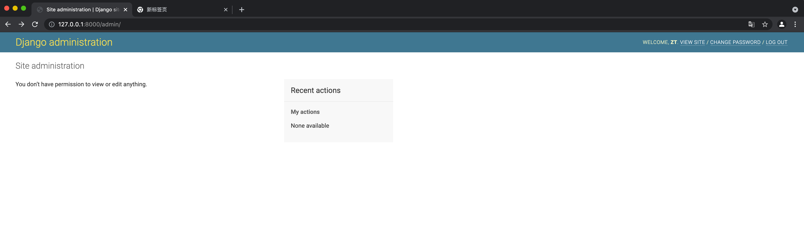
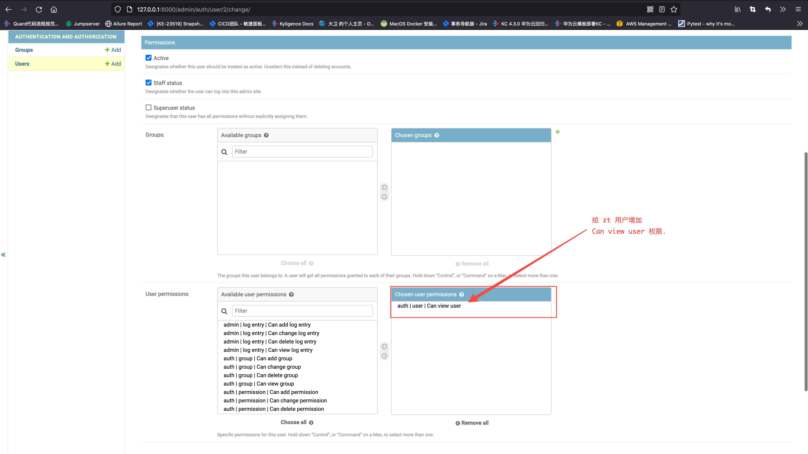
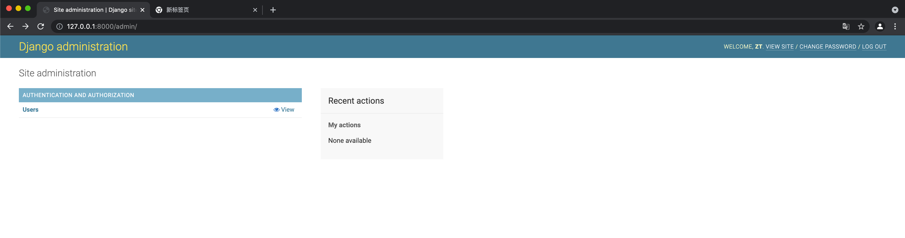
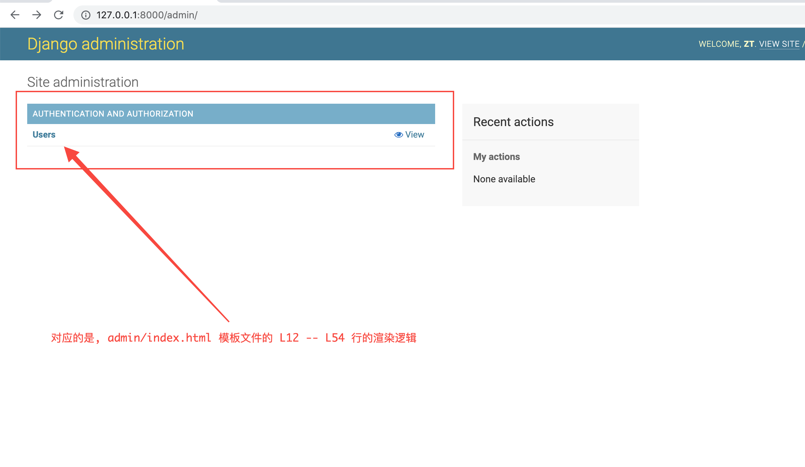

# 问题描述
给一个用户添加 `CanViewUser` 权限时, 在`Django`里面发生了什么?

&nbsp;  
### 赋权之前
普通用户(zt): 登录后看到的页面
<p align="center">
    
</p>

&nbsp;  
### 赋权
管理员用户(admin): 给 `zt` 用户添加 `CanViewUser` 权限
<p align="center">
    
</p>

&nbsp;  
### 赋权之后
普通用户(zt): 增加了 `CanViewUser` 权限后, 再次查看页面
<p align="center">
    
</p>


&nbsp;  
&nbsp;  
# 源代码  
## ORM的预备知识

- [orm有几种关系?](https://docs.djangoproject.com/en/3.2/topics/db/examples/)
- [单表查询: `User.objects.all()`](../orm/SingleTableQuery.md)
- [多对一(InnerJoin)查询: `Permission.objects.all()`](../orm/InnerJoinQuery.md#排序声明)
- [多对多(InnerJoin)查询: `user_obj.user_permissions.all()`](../orm/InnerJoinQuery.md#排序声明)

## 浏览器端的网络请求
当 `zt` 用户访问 `admin` 页面时.   
```shell
URI:     /admin/
METHOD:  GET
TYPE:    Document
```

&nbsp;     
## 服务端的响应处理流程
> 有关 `Django` 路由的介绍，请看 [wsgi](../contrib/wsgi.md) 和 [dataflow](../contrib/auth/dataflow.md)   
> 

&nbsp;  
### 入口函数
当通过 `GET /admin/` 访问 `Django` 时, 触发的是下面[这段源码](../../src/Django-3.0.8/django/contrib/admin/sites.py#L504).
```python
class AdminSite:
    @never_cache
    def index(self, request, extra_context=None):
        """
        Display the main admin index page, which lists all of the installed
        apps that have been registered in this site.
        """
        # 权限接口的数据结构: List[Dict]
        # app_list = [{'app_label': 'auth',
        #              'app_url': '/admin/auth/',
        #              'has_module_perms': True,
        #              'models': [{'add_url': None, 
        #                          'admin_url': '/admin/auth/user/', 
        #                          'name': 'Users', 
        #                          'object_name': 'User', 
        #                          'perms': {'add': False, 'change': False, 'delete': False, 'view': True}, 
        #                          'view_only': True}],
        #              'name': 'Authentication and Authorization'}]
        app_list = self.get_app_list(request)

        # 模板接口的数据结构: Dict
        # context = {'app_list': [{'app_label': 'auth',
        #                          'app_url': '/admin/auth/',
        #                          'has_module_perms': True,
        #                          'models': [{'add_url': None, 
        #                                      'admin_url': '/admin/auth/user/', 
        #                                      'name': 'Users', 
        #                                      'object_name': 'User', 
        #                                      'perms': {'add': False, 'change': False, 'delete': False, 'view': True}, 
        #                                      'view_only': True}],
        #                          'name': 'Authentication and Authorization'}],
        #            'available_apps': [{'app_label': 'auth',
        #                                'app_url': '/admin/auth/',
        #                                'has_module_perms': True,
        #                                'models': [{'add_url': None, 
        #                                            'admin_url': '/admin/auth/user/', 
        #                                            'name': 'Users', 
        #                                            'object_name': 'User', 
        #                                            'perms': {'add': False, 'change': False, 'delete': False, 'view': True}, 'view_only': True}],
        #                                'name': 'Authentication and Authorization'}],
        #            'has_permission': True,
        #            'is_nav_sidebar_enabled': True,
        #            'is_popup': False,
        #            'site_header': 'Django administration',
        #            'site_title': 'Django site admin',
        #            'site_url': '/',
        #            'title': 'Site administration'}
        context = {
            **self.each_context(request),
            'title': self.index_title,
            'app_list': app_list,
            **(extra_context or {}),
        }

        request.current_app = self.name

        return TemplateResponse(request, self.index_template or 'admin/index.html', context)
```

&nbsp;  
### 权限接口
衔接入口函数源码, `self.get_app_list` 是一个完整权限接口返回值.  
TODO: 待补充


&nbsp;  
### 获取用户和组的权限
权限接口通过两种方式来获取用户权限    
```python
class ModelBackend(BaseBackend):

    # 这是读取用户权限的分层逻辑, 它通过 from_name 参数来决定是读取用户权限还是读组权限.
    # from_name 参数目前看到的是: user 和 group 两种.
    # 调用栈是(仅列出重要的函数):
    # django.contrib.auth.models.PermissionsMixin.has_module_perms
    # django.contrib.auth.backends.BaseBackend.get_all_permissions        # 权限数据叠加发生在这里.
    # django.contrib.auth.backends.ModelBackend.get_user_permissions      
    # django.contrib.auth.backends.ModelBackend.get_group_permissions
    def _get_permissions(self, user_obj, obj, from_name):

        # 如果当前用户不是激活类型, 返回空权限.
        # 如果当前用户是匿名用户, 返回空权限.
        if not user_obj.is_active or user_obj.is_anonymous or obj is not None:
            return set()
   
        # 缓存判断
        perm_cache_name = '_%s_perm_cache' % from_name
        if not hasattr(user_obj, perm_cache_name):
   
            # 管理员的话，直接读取所有权限.
            if user_obj.is_superuser:
                perms = Permission.objects.all()
            else:
                # 这行代码转换一下等同于下面这个.
                # perms = self._get_user_permissions(user_obj) 
                # perms = self._get_group_permissions(user_obj)
                perms = getattr(self, '_get_%s_permissions' % from_name)(user_obj)
   
            # 仅列出 content_type__app_label, codename 这两个字段即可.
            # 需要注意的是: Permission 定义了 content_type 是一个外键字段, 
            # 所以 content_type__app_label 可以拿到外键表的 app_label 字段值.
            # 最终呈现的效果是(类型是 str): 'auth.view_user'
            perms = perms.values_list('content_type__app_label', 'codename').order_by()
            setattr(user_obj, perm_cache_name, {"%s.%s" % (ct, name) for ct, name in perms})
        return getattr(user_obj, perm_cache_name)
```   

方式一: 读取用户的权限.
```python
class ModelBackend(BaseBackend):

    # user_obj: <User zyn>
    # User 对象的 user_permissions 属性, 定义在父类(PermissionMixin)中, 用于描述跟 Permission 表示多对多关系.  
    # user_obj.user_permissions.all() 对应的 sql 语句是:
    # SELECT 
    #             `auth_permission`.`id`, 
    #             `auth_permission`.`name`, 
    #             `auth_permission`.`content_type_id`, 
    #             `auth_permission`.`codename` 
    # FROM       
    #             `auth_permission` 
    # INNER JOIN  
    #             `auth_user_user_permissions` ON (`auth_permission`.`id` = `auth_user_user_permissions`.`permission_id`) 
    # INNER JOIN 
    #             `django_content_type` ON (`auth_permission`.`content_type_id` = `django_content_type`.`id`) 
    # WHERE 
    #             `auth_user_user_permissions`.`user_id` = 2 
    # ORDER BY 
    #             `django_content_type`.`app_label` ASC, 
    #             `django_content_type`.`model` ASC, 
    #             `auth_permission`.`codename` ASC'
    def _get_user_permissions(self, user_obj):
        return user_obj.user_permissions.all()

```
   
方式二: 读取用户所属组的权限.
```python
class ModelBackend(BaseBackend):
   
    def _get_group_permissions(self, user_obj):
        # s = get_user_model():   <class 'django.contrib.auth.models.User'>
        # s._meta:                <django.db.models.options.Options label_lower='auth.user' at 0x1234>
        # s.get_field('groups'):  <django.db.models.fields.relate.ManyToManyField many_to_many=True name='auth.User.groups' at 0x1235>   
        user_groups_field = get_user_model()._meta.get_field('groups')
        
        # 在 PermissionMixin 中定义 groups 这个 ManyToMany 字段是, 就已经声明了 related_query_name="user",
        # 所以 user_groups_field.related_query_name() 得到的就是 "user", 
        # 最终拼接成 "group__user" 这个关联查询的字段. 
        user_groups_query = 'group__%s' % user_groups_field.related_query_name()
        
        ##################### 划重点 #####################
        # 上面两行代码, 主要是为了拼装 "group__user" 外部表字段, 含义是: group 表的 user 字段.
        # 正常情况下: 
        #################################################
        
        # {user_groups_query: user_obj} == {"group__user": <django.contrib.auth.models.User name='zyn' at 0x1236>}
        # Permission.objects.filter(**{"group__user": <django.contrib.auth.models.User name='zyn' at 0x1236>}) 对应的 sql 语句是:
        # 
        # SELECT 
        #            `auth_permission`.`id`, 
        #            `auth_permission`.`name`, 
        #            `auth_permission`.`content_type_id`, 
        #            `auth_permission`.`codename` 
        # FROM       
        #            `auth_permission` 
        # INNER JOIN 
        #            `auth_group_permissions` ON (`auth_permission`.`id` = `auth_group_permissions`.`permission_id`) 
        # INNER JOIN 
        #            `auth_group` ON (`auth_group_permissions`.`group_id` = `auth_group`.`id`) 
        # INNER JOIN 
        #            `auth_user_groups` ON (`auth_group`.`id` = `auth_user_groups`.`group_id`) 
        # INNER JOIN 
        #            `django_content_type` ON (`auth_permission`.`content_type_id` = `django_content_type`.`id`) 
        # WHERE 
        #            `auth_user_groups`.`user_id` = 2 
        # ORDER BY 
        #            `django_content_type`.`app_label` ASC, 
        #            `django_content_type`.`model` ASC, 
        #            `auth_permission`.`codename` ASC
        #
        # 从 Permission 对象 或 表 中观察, 并没有定义和描述外键, 
        # 但这里是从 Permission 对象为主线去 filter, 只要传入 'group__user' 和 models.User 对象即可生成这么一串 sql 出来, 太牛逼了.
        return Permission.objects.filter(**{user_groups_query: user_obj})
```


&nbsp;
### 展示页面的渲染  
   [django/contrib/admin/templates/admin/index.html](../../src/Django-3.0.8/django/contrib/admin/templates/admin/index.html#L13) 文件负责渲染 `context` 变量中 `app_list` 字段的内容.  
   
   <p align="center">
       
   </p>

